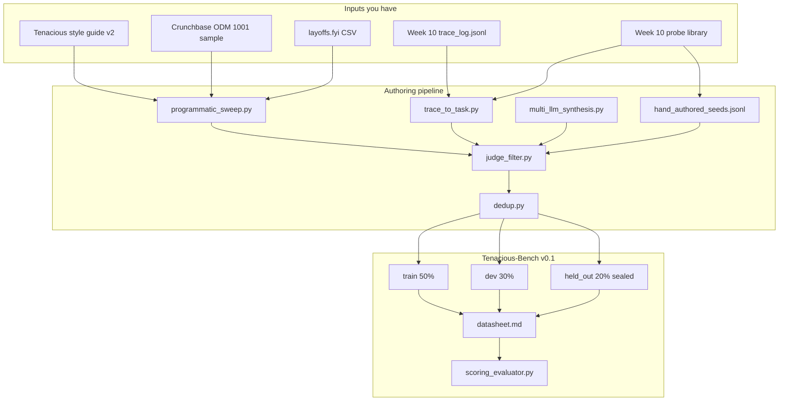

# Datasheet — Tenacious-Bench v0.1

> Follows Gebru et al. (2021), *Datasheets for Datasets*, augmented with
> Pushkarna et al. (FAccT 2022), *Data Cards: Purposeful and Transparent
> Dataset Documentation* — telescopic, periscopic, and microscopic detail.

## Telescopic (one-paragraph summary)

Tenacious-Bench v0.1 is a **240-task** evaluation benchmark (44 in the
interim sample) for B2B sales-agent behavior on the Tenacious workflow.
Tasks grade per-signal confidence honesty, bench-commitment safety, tone
adherence, scheduling guardrails, and dual-control handoff. Built from a
small seed corpus (Tenacious style guide v2, Crunchbase ODM 1,001-company
sample, layoffs.fyi CSV, Week 10 `trace_log.jsonl`) using a routed multi-LLM
authoring pipeline with judge filtering and three-check contamination
prevention.

## Periscopic (8-section middle layer — Gebru §1–§7)

### §1 — Motivation

- **Q: For what purpose was the dataset created?** To grade Tenacious-style
  outbound sales-agent behavior on dimensions τ²-Bench retail cannot
  measure: signal honesty, bench-commitment safety, gap-brief handling,
  staleness awareness, founder-departure pause.
- **Q: Who created it?** Atnabon (TRP1 trainee), Week 11 cohort. No
  external funder. The Tenacious style guide is a synthetic / fictional
  reference standard.
- **Q: Was there a specific gap?** Yes — see [audit_memo.md](audit_memo.md).
  τ²-Bench retail does not grade per-signal confidence, brand tone, or
  Tenacious-specific staffing guardrails.

### §2 — Composition

- **Instances:** 44 tasks in v0.1.0-interim across 11 dimensions and 4
  authoring modes. v0.1.0 final: 240.
- **Fields per instance:** task_id, dimension, source_mode, difficulty,
  input (instruction + signal briefs + bench summary + prospect +
  prior_thread), rubric (banned_phrases, required_grounding, tone_markers,
  structural, scoring_weights), ground_truth, metadata. See
  [schema.json](schema.json).
- **Sample relationships:** every task is independent. Some share Week 10
  trace_id provenance; cross-references are recorded in
  `metadata.week10_provenance`.
- **Recommended split:** stratified 50% train / 30% dev / 20% sealed
  held_out. Held_out shipped encrypted (see
  `tenacious_bench_v0.1/held_out/SEALED.md`).
- **Errors / noise / redundancy:** none knowingly. Authoring-pipeline
  rejects logged in `_pool/rejects.jsonl` (Day 4 artifact).
- **Self-contained:** yes; no external resource is required to evaluate.

### §3 — Collection

- **Acquisition mode:** synthesized from the inputs listed in the
  challenge brief plus Week 10 artifacts. Multi-LLM authoring pipeline
  routes across Claude Sonnet 4.6, GPT-5, Qwen3-Next, DeepSeek V3.2 with
  preference-leakage prevention.
- **Sampling:** stratified across 11 dimensions × 4 source modes.
- **Time frame:** authoring window 2026-04-22 to 2026-04-25.
- **Ethical review:** none required — the underlying public sources
  (Crunchbase ODM, layoffs.fyi) are public. The Tenacious style guide is
  synthetic.

### §4 — Preprocessing / cleaning

- Trace-derived inputs are redacted by `generation_scripts/trace_to_task.py`
  (`REDACTION_PATTERNS`): SSNs, emails, 16-digit numbers.
- All authored tasks pass the 3-dim judge filter at threshold 4/5.
- Dedup at 0.20 8-gram Jaccard before partitioning.

### §5 — Uses

- **Primary:** evaluate sales-agent generators on Tenacious-specific
  failure modes. Pair with the Path B SimPO-trained judge head as a
  rejection layer.
- **Anti-uses:** do *not* use as a measure of general retail / customer
  service competence (use τ²-Bench for that). Do *not* use the Tenacious
  style guide as a stand-in for any real company's brand voice.
- **Caveats:** ground truth for some tasks is partial — `gap_brief_overclaiming`
  tasks rely on a `prospect_has_it_confidence` field the Week 10 schema
  does not yet model (recorded in the skeptic's appendix).

### §6 — Distribution

- **Where:** HuggingFace Hub at `atnabon/tenacious-bench` (Act V upload).
- **License:** **CC-BY-4.0**. Rationale in [methodology.md §6](methodology.md#6-license).
- **IP / patent constraints:** none.
- **Identifiers:** dataset version `v0.1.0-interim` (Wed) and
  `v0.1.0` (Sat). `manifest.json` carries the canonical version.

### §7 — Maintenance

- **Maintainer:** Atnabon (oliyadmilkessa@gmail.com).
- **Update schedule:** quarterly v0.x releases driven by Tenacious
  deployment feedback. v0.2 already has 4 named gaps in the skeptic's
  appendix (memo.pdf page 2).
- **Erratum policy:** corrections committed to a `CHANGELOG.md` and
  the affected partition is reissued under a new minor version.
- **Contributions:** GitHub issues / PRs welcomed; preference-leakage
  rules and contamination thresholds are non-negotiable.

## Microscopic (per-task, per-dimension)

For every task in `train/`, `dev/`, and `held_out/`, the following fields
are present and grade-able with no human in the loop:

```
task_id          → stable identifier
dimension        → one of 11 dimensions
source_mode      → one of 4 authoring modes
difficulty       → one of {easy, medium, hard, adversarial}
metadata.judge_filter_score.{input_coherence, ground_truth_verifiability, rubric_application_clarity}
metadata.week10_provenance.{trace_ids[], probe_ids[]}
metadata.signal_window_start / signal_window_end (when public signal is referenced)
metadata.authoring_model / chosen_source_model / rejected_source_model / judge_model
```

This is the layer reviewers reach for when they need to reproduce or
audit one specific row — for example, to verify that
`TB-DEV-007` was authored by a different family from its judge, or that
`TB-TRAIN-022`'s signal window was deliberately stale.

## Diagrammatic overview


