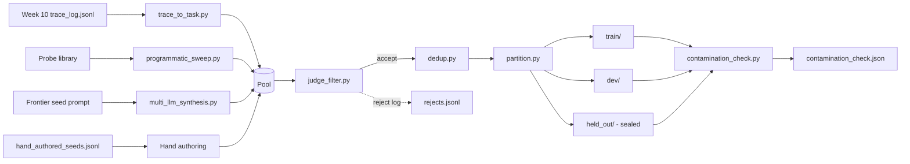

# Generation Pipeline

End-to-end authoring pipeline for Tenacious-Bench v0.1. Reproduces the
committed dataset from a fixed seed (`20260422`).



## End-to-end re-run

```bash
SEED=20260422

python trace_to_task.py \
    --traces ../../conversion-engine/eval/trace_log.jsonl \
    --probes ../../conversion-engine/eval/probes/probe_results.json \
    --out ../tenacious_bench_v0.1/_pool/trace.jsonl --max 80 --seed $SEED

for probe in P012 P007 P027 P031; do
    python programmatic_sweep.py --probe $probe --variants 20 \
        --out ../tenacious_bench_v0.1/_pool/prog_${probe}.jsonl --seed $SEED
done

python multi_llm_synthesis.py --seeds 30 --variants_per_seed 5 \
    --out ../tenacious_bench_v0.1/_pool/synth.jsonl --seed $SEED

python judge_filter.py \
    --in ../tenacious_bench_v0.1/_pool/*.jsonl \
    --out ../tenacious_bench_v0.1/_pool/filtered.jsonl \
    --rejects ../tenacious_bench_v0.1/_pool/rejects.jsonl --seed $SEED

python dedup.py \
    --in ../tenacious_bench_v0.1/_pool/filtered.jsonl \
    --out ../tenacious_bench_v0.1/_pool/dedup.jsonl

# partition (50/30/20) is documented in methodology.md and is a
# stratified split across the 11 dimensions and the 4 source modes.
python contamination_check.py \
    --train ../tenacious_bench_v0.1/train/tasks.jsonl \
    --dev   ../tenacious_bench_v0.1/dev/tasks.jsonl \
    --held_out ../tenacious_bench_v0.1/held_out/tasks.jsonl \
    --out ../tenacious_bench_v0.1/contamination_check.json
```

## Cost discipline

Every API call is logged via `OPENROUTER_LOG_FILE` (set in
`../../.env`). The cost log lives at [../cost_log.md](../cost_log.md).

## Preference-leakage prevention

Per Li et al. (2025): a task generated by family `X` cannot be judged by a
model in family `X`. The router enforces this in `judge_filter.py:pick_judge`.
